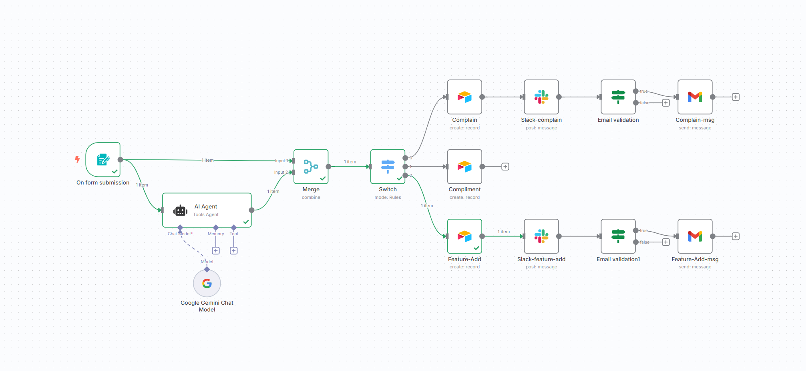

# Automated Feedback Classifier (n8n + Gemini AI)

This project is an automated workflow built in [n8n](https://n8n.io) that:
- Accepts user feedback from a form
- Classifies it using Google Gemini AI as: `Complain`, `Compliment`, or `Feature addition request`
- Saves it to Airtable
- Sends a message to the appropriate Slack channel
- Replies to users via Gmail (if it's a complaint with a valid email)

## 🔗 Live Form
Try it out: [Feedback Form](https://tawkeer.app.n8n.cloud/form/430df33b-243e-42ce-b4f8-c7d45503e0cf)

## 📦 Stack
- n8n
- Google Gemini
- Airtable
- Slack
- Gmail

## 🧠 Prompt Used
See [`prompt.txt`](./prompt.txt)

## 📸 Workflow Preview

## 📄 License
MIT (or any you prefer)
